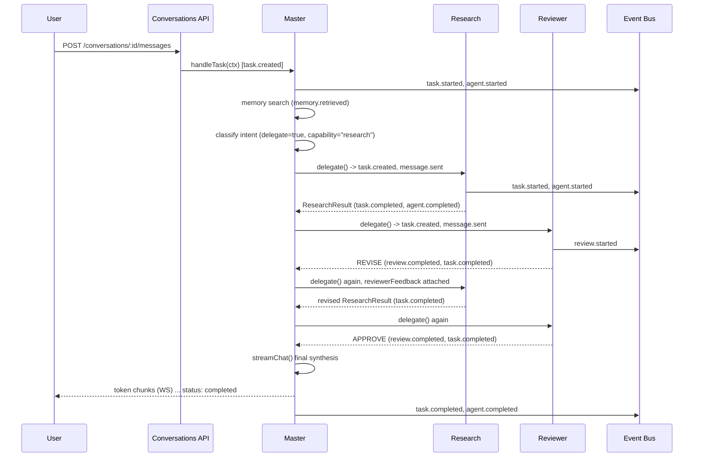
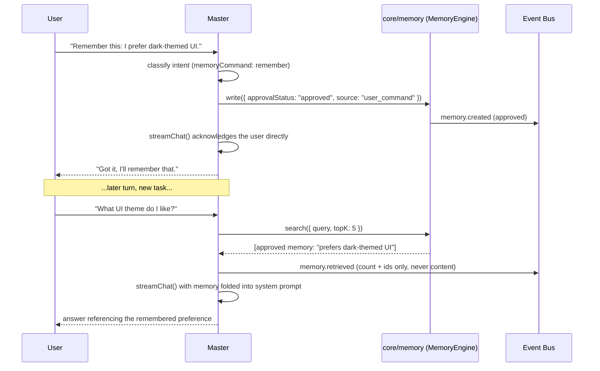

# Agent Interfaces, A2A Layer, and MCP Tool Layer

Full type definitions: `packages/shared-types/src/a2a`, `.../agents`,
`.../mcp`.

## 1. The `Agent` contract

```ts
interface Agent {
  card: AgentCard;
  handleTask(ctx: AgentRuntimeContext): Promise<void>;
  onCancel?(taskId: string): Promise<void>;
  healthCheck(): Promise<{ healthy: boolean; detail?: string }>;
}
```

An agent does not call providers, tools, or other agents directly — it does
everything through `AgentRuntimeContext` (`selectModel`, `callTool`,
`delegate`, `emit`). This is the dependency-inversion seam that keeps
agents unit-testable (mock the context) and keeps the Model Router / MCP
host / A2A layer as the only places that actually reach a provider, a tool,
or another agent.

## 2. Agent Registry

| Agent id | Role | Status |
|---|---|---|
| `master` | Orchestrator, primary chat surface, classification + delegation | **Implemented (M3)** |
| `research` | Structured research/findings, honest about lacking live tools | **Implemented (M3)** |
| `reviewer` | Validates another agent's output before it reaches Master; never reviews itself | **Implemented (M3)** |
| `crypto-intel` | Crypto market analysis, on-chain context | Future milestone |
| `stock-intel` | Equities/market analysis | Future milestone |
| `business-intel` | Company/opportunity research | Future milestone |
| `social-media` | Social trend/sentiment analysis | Future milestone |
| `ai-radar` | Tracks AI model/tooling landscape | Future milestone |
| `news-intel` | News synthesis and relevance filtering | Future milestone |
| `guardian` | Security/policy enforcement, approval-gate checks | Future milestone (M3's Reviewer covers output validation only, not policy enforcement) |
| `memory-agent` | Dedicated memory read/write agent | Not planned as a fourth agent yet — M3 gives Master itself the only write path (`core/memory`), see §7 |

Registered as data (`agents` table + `agent_delegation_edges`), not as a
switch statement — adding an agent means writing a new
`core/agents/<name>/index.ts` implementing `Agent`, calling
`agentRegistry.register()` on it in `index.ts`, and inserting its
`agents`/`agent_delegation_edges` rows via migration; nothing in
`core/router` or the API layer changes. M3 explicitly stops at the
three-agent roster above — see `09-roadmap.md` for what's still ahead.

## 3. Master Agent decision flow (as implemented, M3)

`core/agents/master/masterAgent.ts`'s `handleTask` runs, in order, for every
chat task:

1. `ctx.start()` — `submitted → working`, publishes `task.started` +
   `agent.started` (the root task's own lifecycle; `delegate()` does the
   same thing on a child's behalf, so root and delegated tasks look
   identical on the event bus — see the sequence diagrams below).
2. **Context retrieval (M3.7).** `memoryEngine.search({ query: userText,
   topK: 5 })` — only the top-K *relevant* approved memories, never the
   whole table — and, if any came back, publishes `memory.retrieved`
   (count + ids only, never content) and folds them into the system
   prompt as "relevant memory" context.
3. **Intent classification.** One `completeChat` call (always plain AUTO —
   see `06-provider-model-interfaces.md` §4.4) against a small classifier
   prompt built from
   `agentRegistry.getDelegationOptions('master')`'s *live* capability list
   (never a hardcoded set) produces an `IntentClassification`: whether to
   delegate (and to which capability), an explicit remember/forget
   command, and/or a conservative system-proposed memory candidate.
4. **Memory commands (M3.6).** An explicit "Remember this" writes an
   `approved` memory sourced `user_command`. An explicit "Forget this"
   searches for the best-matching memory and soft-deletes it, or honestly
   reports no match was found. A system-proposed candidate is written
   `pending` — never auto-approved — and stays invisible to retrieval
   until a human approves it via `POST /memory/:id/approve`.
5. **Delegation + bounded revision loop.** If classification says to
   delegate, `agentRegistry.findByCapability(capability)` picks a target
   (capability-based, not a hardcoded agent id), and Master runs up to two
   attempts: `delegate('research', ...)` → `delegate('reviewer', {
   targetTaskId, targetAgentId, result })`. `APPROVE` stops the loop with
   the findings kept; `REJECT` stops the loop and the findings are
   discarded (Master discloses the failure honestly instead of presenting
   rejected content as fact); `REVISE` feeds the reviewer's issue list
   back into a second Research attempt, then the loop always stops
   (bounded at one revision, per `MAX_RESEARCH_ATTEMPTS = 2`).
6. **Synthesis.** Whatever the delegation outcome (findings, an honest
   "no capability available" note, or nothing at all for a direct
   answer), Master builds the final message list and calls
   `ctx.streamChat(...)` — the one call in this whole flow that honors
   the *user's actual* routing preference (AUTO/MANUAL, preferred
   provider/model) — streaming tokens to the client via `ctx.emit()` as
   they arrive.
7. `ctx.addAssistantMessage(text)` persists the reply into this task's
   message thread (so the next turn's conversation history includes it),
   then `ctx.finishSuccess({ text, modelId, providerId }, modelId)` marks
   the task `completed` and publishes `task.completed` + `agent.completed`.

Every `agent_progress` chunk Master or a delegated agent emits (e.g.
"Research Agent working…") is a short, human-readable label — never
chain-of-thought or raw model reasoning, per `07-security-model.md`.

### 3.1 Sequence: delegation with a REVISE round, then APPROVE



### 3.2 Sequence: explicit memory command + context retrieval on a later turn



## 4. A2A layer

`core/a2a` implements the `Task` state machine
(`submitted → working → input-required|completed|failed|canceled`) and
message passing described in `packages/shared-types/src/a2a`. For M1–M8 all
agents are `isInternal: true` and dispatch happens as direct in-process
function calls; the state machine and persistence (`tasks`,
`task_messages`) are identical to what a real network A2A call would use,
so an agent can be moved to `isInternal: false` with an `externalEndpoint`
later — the orchestrator's `delegate()` call doesn't change, only the A2A
layer's transport implementation for that one agent id.

Cancellation, streaming (`TaskStreamChunk`), and error propagation
(`TaskError.retryable`) are first-class so the Model Router can distinguish
"try a fallback model" from "surface this failure."

**M3 additions, as implemented in `core/agents/runtimeContext.ts` and the
`0018_m3_agents_a2a_memory.sql` migration:**
- Every task carries a `correlation_id` (the root task's own id,
  propagated unchanged to every descendant `delegate()` creates) and an
  `attempt` counter — the "retry metadata" and "correlation ID" the A2A
  task lifecycle calls for.
- `delegate(toAgentId, input, taskType)` checks
  `agent_delegation_edges` via `isDelegationAuthorized(fromAgentId,
  toAgentId)` **before** creating the child task — the only mechanism by
  which one agent may delegate to another; the M3 seed data authorizes
  exactly `master → research` and `master → reviewer` and nothing else,
  so Research and Reviewer cannot delegate to anything.
- `cancelTaskCascade(pool, correlationId)` cancels every task in a
  delegation tree still `submitted`/`working` (leaving already-terminal
  tasks alone) — cancellation is still best-effort (no AbortSignal into
  an in-flight provider fetch, see `08-deployment-architecture.md`), but
  now propagates across the whole tree instead of stopping at the root
  task.
- A safety net in `delegate()`: if a child agent's `handleTask` returns
  (or throws) without calling `finishSuccess`/`finishFailure`, the parent
  marks that child task `failed` with `agent_did_not_finalize` rather
  than leaving it stuck `working` forever.

## 5. MCP tool layer — **implemented, M4**

Tools live in `core/mcp`, are registered via `ToolHandler`, and are called
only through the `ToolRegistry`/host — never directly by an agent. This
gives three things for free:
- **Agent-agnostic tools.** The same `web_search` implementation would
  serve any future agent, not just `research` — nothing about the tool
  itself is Research-specific.
- **Central risk gating.** `requiresApproval` tools (e.g. anything that
  spends money or executes code) pause at `awaiting_approval` regardless of
  which agent invoked them, enforced by `agent_tool_grants` +
  `evolution_proposals`-style approval, not by each agent remembering to
  check. None of M4's seven built-in tools set `requiresApproval` — see
  `11-mcp-tools.md` §11.
- **External MCP servers as tool sources.** `connectServer(url)` lets a
  third-party MCP server (including ones exposed by n8n or future
  integrations) register tools the same way a built-in tool does — not
  built in M4 yet; `ToolRegistryService.connectServer` throws a clear,
  honest "not implemented" error rather than a silent no-op.

**M4 reality:** the MCP host is real (`core/mcp/mcpHost.ts`'s
`invokeTool()`) — `AgentRuntimeContext.callTool` now actually discovers,
permission-checks, executes, times out, and durably records every
invocation. Full detail — the seven built-in tools, the Tool Registry
schema, permissions, SSRF protection, prompt injection defenses, and the
Research Agent integration — lives in its own document:
**`11-mcp-tools.md`**, since this is substantial enough content to not
cram into this file's margins.

## 6. Bots are not agents

Bots (`core/bots`) never implement the `Agent` interface and never call a
model. A bot's job ends at writing a `bot_findings` row; if that finding
warrants judgment, the Bot Engine creates a `Task` assigned to the bot's
configured `escalate_to_agent_id` (see `bots.escalate_to_agent_id` in the
schema) — that hand-off is the only point where a bot's output enters the
agent world. See `05-event-schemas.md` for the `bot.*` / `agent.*` event
split that makes this pipeline observable end-to-end.

## 7. Memory subsystem (M3.6/M3.7)

`core/memory/memoryEngine.ts` (`MemoryEngineService`) implements the
`MemoryEngine` interface over `memory_items` (`db/repositories/memoryRepo.ts`).
Master is the only caller in M3 — there is no dedicated memory-agent, which
keeps write access to a single, auditable path without adding a fourth
agent this milestone (see the roster table in §2).

**Categories** (`MemoryCategory`): `personal_context`, `projects`, `goals`,
`preferences`, `decisions`, `research`, `knowledge`, `conversations`,
`agent_lessons`.

**Retrieval** is real, working lexical/trigram ranking today —
`similarity(content, query) * 0.6 + importance * 0.2 + confidence * 0.1 +
(pinned ? 0.1 : 0)` via Postgres' `pg_trgm` extension — not a placeholder.
Cross-vendor vector embeddings (one embedding space usable across five
different model providers) are a documented near-term addition, not
something faked with a fixed/random vector to look implemented.

**Approval policy** (`approval_status`): `approved` items are retrievable;
`pending` items are not, until a human calls `POST /memory/:id/approve`
(or `.../reject`, which leaves them permanently excluded). Two paths reach
`approved` directly, and only two:
- An explicit "Remember this." user command (`source: "user_command"`) —
  direct user intent is its own approval, no extra step.
- Manual creation via `POST /memory` from the mobile Vault/Memory screen.

Everything else — a system-proposed candidate the classifier notices in
passing (`source: "system_proposed"`) — is written `pending` and never
auto-approved, and Master **does not** store every conversation turn by
default; the classifier is instructed to propose a candidate only for
something clearly durable and specific (a stated preference, an ongoing
project, a firm decision), and to prefer `null` otherwise (see
`core/agents/master/intentClassifier.ts`'s system prompt).

**Context retrieval** happens once per Master task, before classification:
`memoryEngine.search({ query: userText, topK: 5 })` — bounded, relevant
memories only, never a full-table dump — and, when anything comes back,
publishes `memory.retrieved` with a count and the matched ids, never the
memory content itself (`07-security-model.md`).
